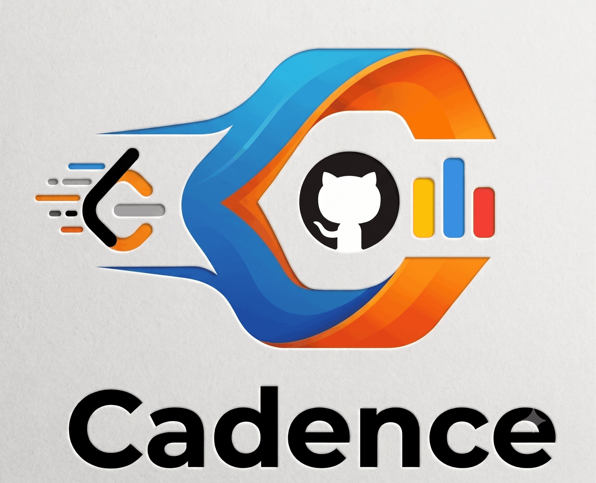
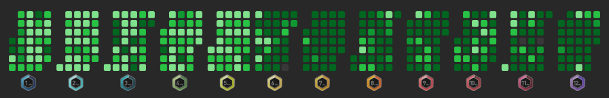
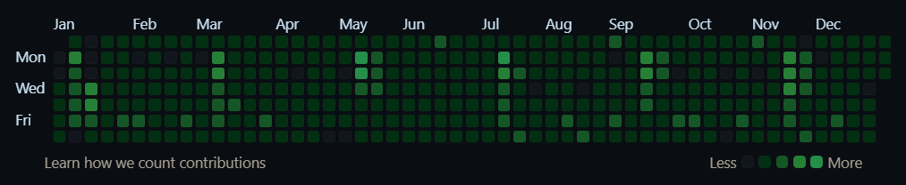
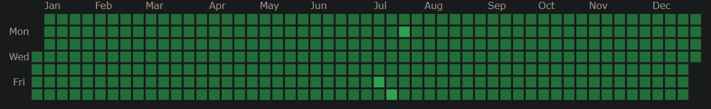

<p align="center">
  
</p>

# Cadence

**A Browser Native Accountability Layer for Daily Competitive Programming & Contribution Streaks**

I built Cadence because reminder apps you have to open don't work you forget to open them. Cadence instead surfaces itself: an aggressive, persistent banner injected directly into every webpage you browse, staying visible until you've actually done the work.

Cadence continuously tracks three independent signals of daily progress a LeetCode daily challenge solve, a GitHub contribution, and a Codeforces submission and refuses to let you forget about any of them until they're done.

## 🚀 What It Does

Cadence runs silently in the background of your browser, polling each platform on a fixed interval. The moment it detects a gap in your daily streak, it renders a floating reminder card on top of whatever page you're currently on LeetCode, GitHub, Codeforces, or anything else with direct links back to the platform, a manual re-verification action, and short-term snooze controls (+2h / +6h) for when you're mid-focus and don't want the interruption yet.

## 🧩 Architecture & Components

Cadence is built as a Manifest V3 browser extension, split cleanly across a background service worker, a content-injected UI layer, and a settings surface:

**Background Service Worker (`background.js`)**
The persistent polling core. Runs on a 5-minute `chrome.alarms` cycle, independently querying three external APIs LeetCode's GraphQL endpoint, GitHub's GraphQL contribution calendar, and Codeforces' public REST API and reduces each response down to a single boolean "done for today" state, written to `chrome.storage.local`.

**Content Script (`content.js`)**
Injected into every page via a `<all_urls>` match. Reads live state out of extension storage and renders a self-contained, dependency-free reminder card directly into the DOM no iframe, no external assets, styled entirely through an injected `<style>` block so it survives on any host page regardless of that page's own CSS.

**Options Page (`options.html` / `options.js`)**
A minimal settings surface for configuring your LeetCode username, Codeforces handle, and GitHub username + Personal Access Token. Nothing is bundled or hardcoded, every identity is user-supplied and stored exclusively in local extension storage.

## 📖 Daily-Progress Detection Logic

Each of the three platforms is checked independently and asynchronously, and a failure in one never blocks the others:

- **LeetCode** : fetches the active daily coding challenge, then cross-references your last 15 accepted submissions for a match timestamped after midnight IST.

  

- **GitHub** : authenticates via a user-supplied PAT and queries the GraphQL contribution calendar for a non-zero contribution count on the current UTC date.

  

- **Codeforces** : pulls your last 20 submissions from the public API and checks for anything timestamped after midnight IST.

  

If any network call fails, Cadence doesn't fail silently or spam retries it schedules a single one-minute retry alarm for that specific check and leaves the others unaffected. A global snooze respects your focus time by suppressing re-flagging until it expires, at which point checks resume automatically.

## ⚙️ Installation

Cadence isn't on the Chrome Web Store, so it's installed as an unpacked extension. This takes about two minutes:

1. **Download the code.**
   Either clone the repo:
     ```
     git clone https://github.com/LeadingTheAbyss/Cadence.git
     ```
   Or click the green **Code** button on the GitHub repo page, then **Download ZIP**, then extract it somewhere permanent (don't delete this folder later, the browser loads the extension directly from it).

2. **Open your browser's extensions page.**
   Chrome: go to `chrome://extensions`
   Edge: go to `edge://extensions`
   Brave: go to `brave://extensions`
   (Any Chromium-based browser works the same way, just swap the prefix.)

3. **Turn on Developer mode.**
   Look for the **Developer mode** toggle, usually in the top right corner of the extensions page. Switch it on. This unlocks the "Load unpacked" option.

4. **Load the extension.**
   Click **Load unpacked**.
   In the file picker, select the folder you cloned/extracted in step 1, the one that directly contains `manifest.json`.
   Cadence should now appear in your extensions list with its icon, and pinned/visible in your browser toolbar (click the puzzle piece icon and pin it if it's hidden).

5. **Verify it loaded correctly.**
   You shouldn't see any red "Errors" button on the extension's card. If you do, click it to see what failed (usually a wrong folder was selected in step 4).

## 🔑 Setup

Cadence ships with no accounts or tokens baked in, you tell it who you are. Nothing works until you complete this step.

1. **Open the Options page.**
   Right-click the Cadence icon in your browser toolbar, then **Options**.
   Or go to your extensions page (`chrome://extensions`), find Cadence, and click **Details**, then **Extension options**.

2. **Fill in the platforms you want tracked.** All three are optional and independent, leave any of them blank to skip that check entirely, no extra config needed.

   **LeetCode username**
     Enter your public LeetCode username exactly as it appears in your profile URL (`leetcode.com/u/<this-part>/`).

   **Codeforces handle**
     Enter your Codeforces handle exactly as it appears in your profile URL (`codeforces.com/profile/<this-part>`).

   **GitHub username + Personal Access Token**
     GitHub's contribution calendar isn't available through a public, unauthenticated API, you need to supply a token so Cadence can query it on your behalf.
     1. Go to [github.com/settings/tokens](https://github.com/settings/tokens).
     2. Click **Generate new token**, then **Generate new token (classic)**.
     3. Give it any name you'll recognize later, e.g. `Cadence extension`.
     4. Under **Expiration**, pick whatever you're comfortable with (no expiration works, but a 90 day rotation is safer).
     5. Under **Select scopes**, check only **`read:user`**, nothing else is required.
     6. Click **Generate token** at the bottom.
     7. Copy the token immediately (GitHub only shows it once).
     8. Paste it into the **GitHub Personal Access Token** field in Cadence's Options page, and also fill in your **GitHub username** in the field above it.

3. **Save.**
   Click **Save**. Cadence immediately runs a fresh check against every platform you configured, so you'll see the banner state update right away instead of waiting for the next 5 minute poll.

4. **Confirm it's working.**
   Visit any webpage. If you have an incomplete daily on any configured platform, the reminder card should appear in the bottom right corner within a few seconds.
   If nothing appears and you expected it to, open the background service worker's console (`chrome://extensions`, then Cadence, then the **service worker** link under "Inspect views") and check for errors, a typo'd username/handle or an incorrectly scoped token are the most common causes.

Tokens and usernames never leave your machine except in direct, authenticated calls to that platform's own API, nothing is proxied, logged, or sent to any third party.

## 🔐 Permissions

- `alarms`, `storage` : periodic background polling and local state persistence.
- `host_permissions` for `leetcode.com`, `api.github.com`, `codeforces.com` : direct API access.
- `<all_urls>` content script match : so the reminder can surface on any page you're browsing, not just the tracked platforms.
